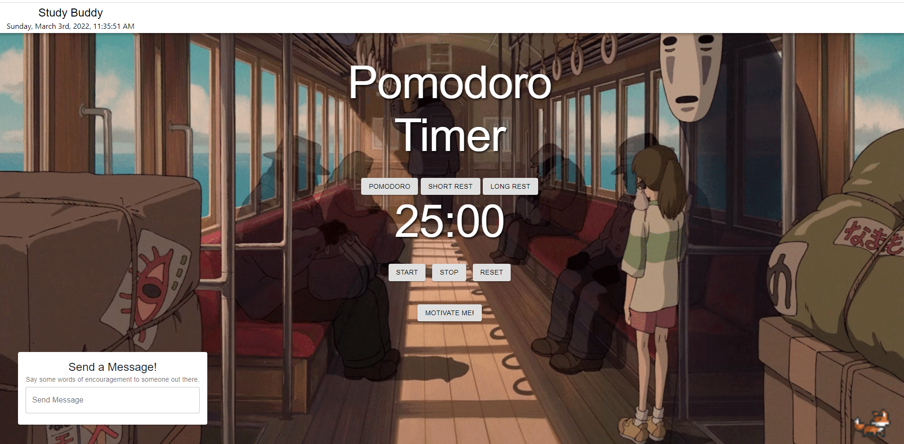
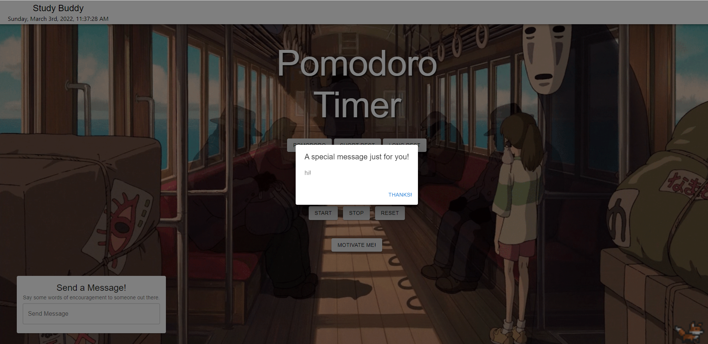
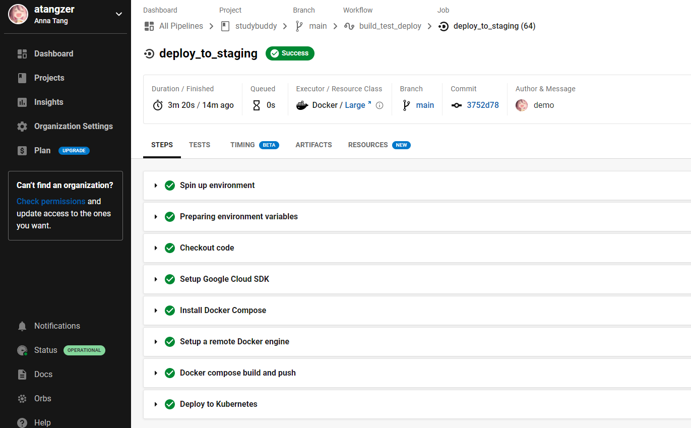
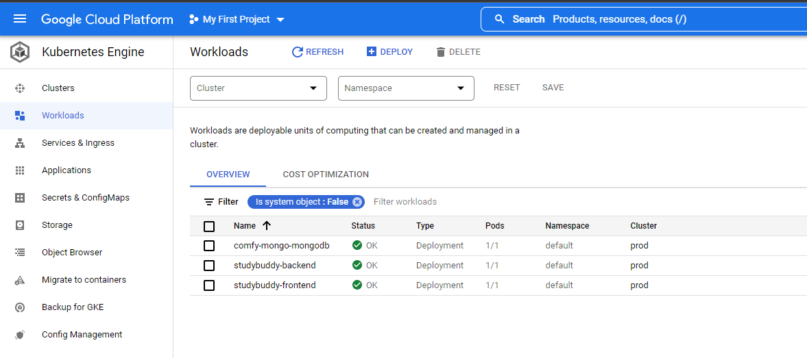

# Comfy Pomodoro: Your Study Buddy! 

The pomodoro timer has become a healthy productivity favourite over the past few years! We help bring this to you, adding encouraging feedback to you to keep you working at your best!

Send words of encourage to other users out there, and open up messages from others as well. You also have a cute little fox at the right corner to keep you company while you work!

<p align = 'center'>
  
</p>

<p align = 'center'>
  
</p>

## Technology Stack

For the pomodoro web application itself, we used the MERN stack (MongoDB, Express.js, React, Node.js).

The end product is deployed onto Google Cloud Platform (Google Kubernetes Engine) via CircleCI, and Docker was used to containerize the application into three seperate containers - the frontend, backend and database.

The benefit of using CircleCI was to streamline our deployment onto production and consistently creating new releases while minimizing downtime.

<p align = 'center'>
  
</p>

<p align = 'center'>
  
</p>

## Launch Application via Docker

Make sure you have Docker Desktop or Docker CLI installed.

```
git clone https://github.com/atangzer/studybuddy.git
docker compose build
docker compose up
```
Access application at localhost:3000.

Access this application on GCP as well: http://35.202.122.87:3000/ (**Note:** Please run the project on localhost:3000 instead, only the frontend is working at the moment on GCP)

## Credits

We used a [boilerplate template](https://github.com/sahat/hackathon-starter/) for this project.
